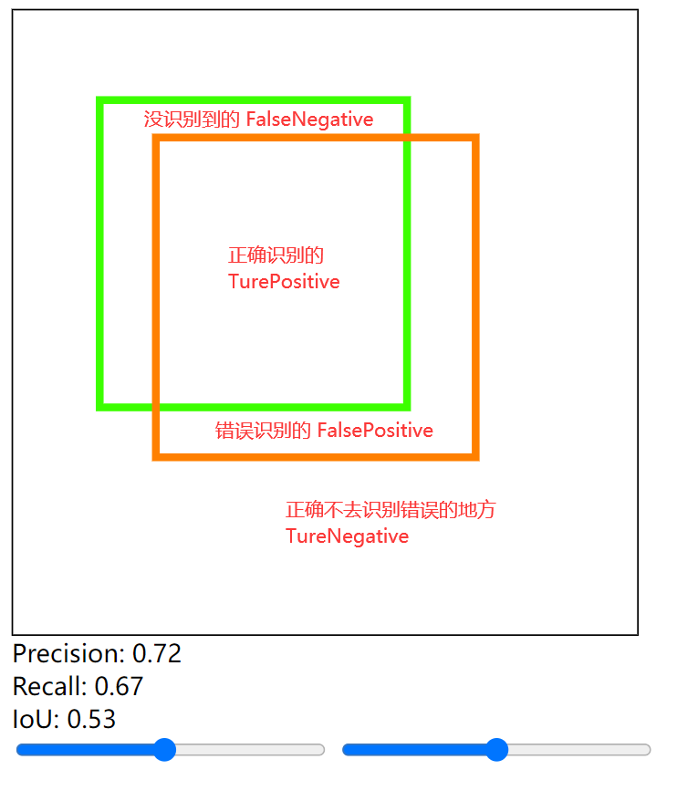

# 一张图快速理解什么是 Precision（精度） Recall（召回率） IoU

网上讲解这几个机器学习概念的时候，往往讲的比较复杂，其实就是简单的数学公式

既然是数学公式，我就想做个可视化，于是写了一点 HTML，简洁地表达了这个概念。

## 设计思路

识别其实很简单，就是「输入问题」和「输出答案」，我们各自用「绿框」和「橙框」表示出来。

既然有问题和答案，就会有正确的和错误的，于是我们分为四部分。

根据数学公式，把三个参数计算出来。



计算部分如下，相信很容易看出来。

```js
function calculateOverlap() {
    var rect1 = box1.getBoundingClientRect();
    var rect2 = box2.getBoundingClientRect();
    
    // 获取基础信息
    var Box1Area = (rect1.right -rect1.left) * (rect1.bottom - rect1.top);
    var Box2Area = (rect2.right -rect2.left) * (rect2.bottom - rect2.top);
    var AllArea = 400*400;
    var overlapWidth = Math.max(0, Math.min(rect1.right, rect2.right) - Math.max(rect1.left, rect2.left));
    var overlapHeight = Math.max(0, Math.min(rect1.bottom, rect2.bottom) - Math.max(rect1.top, rect2.top));
    
    // 计算四面积
    var TurePositive = overlapWidth * overlapHeight;
    var FalseNegative = Box1Area - TurePositive;
    var FalsePositive = Box2Area - TurePositive;
    var TrueNegative = AllArea - TurePositive;

    // 计算指标
    var precisionArea = TurePositive / Box1Area;
    var recallArea = TurePositive / Box2Area;
    var iouArea = TurePositive / (TurePositive + FalseNegative + FalsePositive);
    
    // 渲染
    precisionElement.innerHTML = 'Precision: ' + precisionArea.toFixed(2);
    recallElement.innerHTML = 'Recall: ' + recallArea.toFixed(2);
    iouElement.innerHTML = 'IoU: ' + iouArea.toFixed(2);
}

```

然后再增加方框可拖动，面积可修改即可。

因为 Github 风味的 Markdown 不支持 `iframe` 标签，我就不放在 README.md 里了。

`<iframe src='index.html'></iframe>`

不过这个 html 我用其他 md 渲染器也没加载出来。

但下文中这首歌的 `iframe` 在 Obsidian 上可以渲染出来，可能和 Obsidian 是 Electron 开发的有关。

`<iframe frameborder="no" border="0" marginwidth="0" marginheight="0" width=100% height=100% src="https://music.163.com/outchain/player?type=2&id=1859652717&auto=0&height=66"></iframe>`
